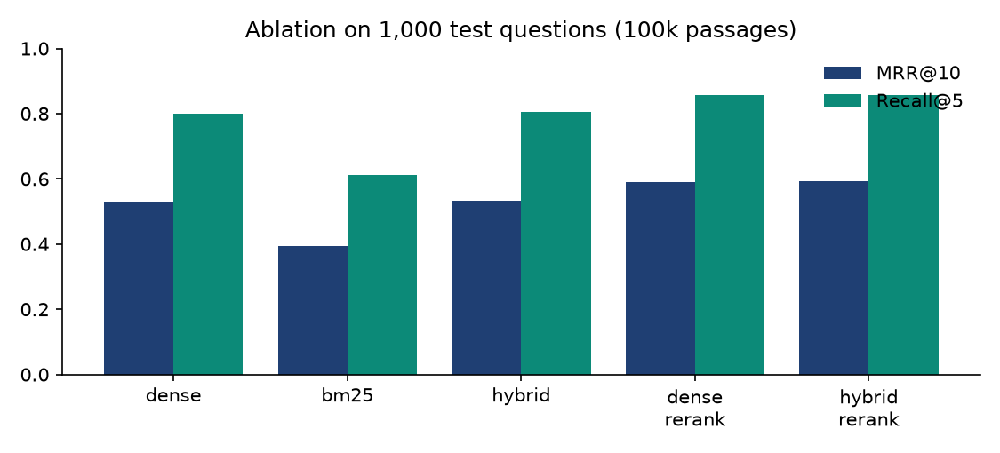
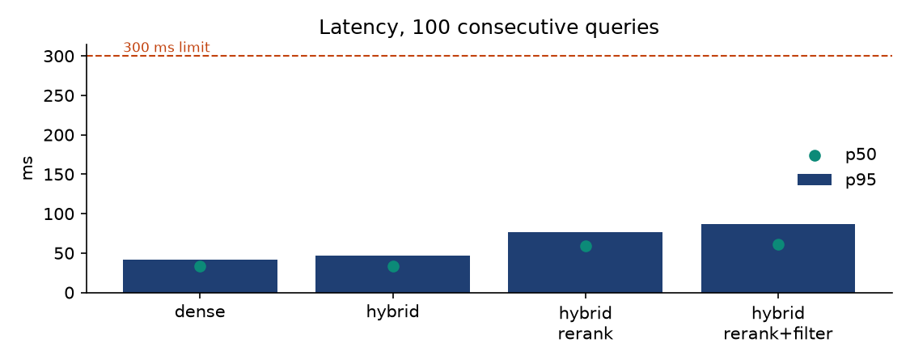

# PrecisionRAG — Benchmark Report (Team OutLiers)

_Generated by `scripts/make_report.py` from the files in `results/`. Every number has a source file; anything not run yet says NOT MEASURED YET._

## 0. Deployed configuration: 100k on the CPU, 500k on the GPU

**100k on the CPU profile (reranker reads the top 10) — 1,000 test questions:**

| Mode | MRR@10 | nDCG@10 | Hit@5 | Recall@5 | MRR vs dense (95% CI) |
|---|---|---|---|---|---|
| Dense (Phase 1 baseline) | 0.533 | 0.625 | 0.819 | 0.801 | — |
| BM25 only | 0.394 | 0.483 | 0.635 | 0.613 | -0.139 [-0.164, -0.113] |
| Hybrid (dense + BM25, weighted RRF) | 0.535 | 0.627 | 0.824 | 0.807 | +0.002 [-0.004, +0.009] |
| Dense + reranker (ablation) | 0.586 | 0.665 | 0.859 | 0.845 | +0.053 [+0.034, +0.073] |
| **Hybrid + reranker (Phase 2)** | 0.581 | 0.656 | 0.844 | 0.830 | +0.048 [+0.027, +0.069] |

**RAGAS, 100k on the CPU (judge gpt-oss-120b, the same 50 questions):**

| Mode | Questions | Context Precision | Context Recall | Note |
|---|---|---|---|---|
| Dense (Phase 1 baseline) | 50 | 0.788 | 0.860 | same top-5 as the GPU for all 50 questions (shared score) |
| Hybrid (dense + BM25, weighted RRF) | 50 | 0.794 | 0.840 | same top-5 as the GPU for all 50 questions (shared score) |
| **Hybrid + reranker (Phase 2)** | 50 | 0.809 | 0.900 | scored on the CPU |

**Latency, 100k on the CPU, 100 consecutive queries (same session as the 500k GPU run):**

| Mode | p50 ms | p95 ms | p99 ms | p95 < 300 |
|---|---|---|---|---|
| Dense (Phase 1 baseline) | 33.5 | **42.2** | 46.5 | ✅ |
| Hybrid (dense + BM25, weighted RRF) | 33.2 | **46.1** | 50.8 | ✅ |
| **Hybrid + reranker (Phase 2)** | 110.5 | **139.7** | 162.3 | ✅ |
| Hybrid + reranker + category filter | 114.3 | **143.7** | 163.0 | ✅ |

**Topic routing, 100k on the CPU (Phase 2, 1,000 test questions):**

| Setting | MRR@10 | Recall@5 | Routed right | vs no filter (95% CI) |
|---|---|---|---|---|
| none | 0.580 | 0.830 | — | — |
| auto1 | 0.444 | 0.608 | 71.0% | -0.136 [-0.158, -0.112] |
| auto2 | 0.513 | 0.711 | 84.1% | -0.067 [-0.083, -0.050] |
| auto3 | 0.542 | 0.756 | 90.7% | -0.038 [-0.051, -0.024] |
| oracle | 0.654 | 0.881 | — | +0.074 [+0.062, +0.086] |

**Index build on the CPU:** 100,000 passages in 21.59 min (limit 120; dense encoding 20.7 min).

The 500k GPU numbers are in section 9. Sections 2–4 and 8 are the 100k index measured on the GPU profile during development (reranker top 20).

## 1. Index build (rule FR-1: < 2 hours on consumer hardware)

| Passages | Profile | Hardware | Dense s | BM25 s | Upload s | Total | < 120 min | Source |
|---|---|---|---|---|---|---|---|---|
| 100,000 | gpu | NVIDIA GeForce RTX 3050 6GB Laptop GPU | 100.3 | 17.6 | 43.0 | **3.17 min** | ✅ | `results/index_build_100000.json` |
| 100,000 | cpu | CPU only (GPU not used) | 1243.9 | 8.4 | 22.9 | **21.59 min** | ✅ | `results/index_build_100000_cpu.json` |
| 500,000 | gpu | NVIDIA GeForce RTX 3050 6GB Laptop GPU | 525.5 | 120.3 | 283.5 | **16.79 min** | ✅ | `results/index_build_500000.json` |

## 2. RAGAS — Phase 1 vs Phase 2, 100k, GPU profile (rules C-02, C-07, NFR-1/2)

Judge models run on Groq's free tier at temperature 0. Each comparison uses the **same judge and the same questions**. The official judge is `openai/gpt-oss-120b`; others are independent cross-checks.

| Judge | Mode | Questions | Context Precision | Context Recall |
|---|---|---|---|---|
| openai/gpt-oss-120b | Dense (Phase 1 baseline) | 50 | 0.788 | 0.860 |
| openai/gpt-oss-120b | Hybrid (dense + BM25, weighted RRF) | 50 | 0.794 | 0.840 |
| openai/gpt-oss-120b | **Hybrid + reranker (Phase 2)** | 50 | 0.814 | 0.900 |
| openai/gpt-oss-20b | Dense (Phase 1 baseline) | 19 | 0.799 | 0.789 |
| openai/gpt-oss-20b | **Hybrid + reranker (Phase 2)** | 16 | 0.758 | 0.688 |

**Phase 1 vs Phase 2 on the same questions (paired):**

| Judge | Metric | Questions | Dense (P1) | Hybrid+rerank (P2) | Change | 95% CI |
|---|---|---|---|---|---|---|
| openai/gpt-oss-120b | Context Precision | 50 | 0.788 | 0.814 | +0.026 | [-0.042, +0.095] |
| openai/gpt-oss-120b | Context Recall | 50 | 0.860 | 0.900 | +0.040 | [-0.060, +0.140] |
| openai/gpt-oss-20b | Context Precision | 15 | 0.789 | 0.742 | -0.048 | [-0.174, +0.072] |
| openai/gpt-oss-20b | Context Recall | 15 | 0.733 | 0.667 | -0.067 | [-0.333, +0.267] |

## 3. Ablation with human labels, 100k, GPU profile (1,000 held-out test questions)

Paired bootstrap 95% confidence intervals: if the interval excludes 0, the change is not luck.

| Mode | MRR@10 | nDCG@10 | Hit@5 | Recall@5 | MRR vs dense (95% CI) | better/same/worse |
|---|---|---|---|---|---|---|
| Dense (Phase 1 baseline) | 0.531 | 0.624 | 0.817 | 0.799 | — | — |
| BM25 only | 0.394 | 0.483 | 0.634 | 0.612 | -0.137 [-0.163, -0.111] | 227/241/532 |
| Hybrid (dense + BM25, weighted RRF) | 0.534 | 0.625 | 0.821 | 0.804 | +0.002 [-0.004, +0.009] | 96/839/65 |
| Dense + reranker (ablation) | 0.591 | 0.675 | 0.872 | 0.858 | +0.059 [+0.039, +0.079] | 342/468/190 |
| **Hybrid + reranker (Phase 2)** | 0.592 | 0.675 | 0.871 | 0.857 | +0.060 [+0.039, +0.081] | 348/457/195 |

## 4. Latency, 100k, GPU profile (rules NFR-3, C-05)

2026-10-02T20:42:14+00:00 · gpu profile · NVIDIA GeForce RTX 3050 6GB Laptop GPU · 100 consecutive queries per mode · cache off · end-to-end HTTP time

| Mode | n | p50 ms | p95 ms | p99 ms | max ms | p95 < 300 | median server stages (ms) |
|---|---|---|---|---|---|---|---|
| Dense (Phase 1 baseline) | 100 | 33.3 | **41.6** | 42.8 | 44.4 | ✅ | embed_dense 13.64, qdrant 17.97 |
| Hybrid (dense + BM25, weighted RRF) | 100 | 33.4 | **47.0** | 49.5 | 49.9 | ✅ | embed_dense 13.96, embed_bm25 0.06, qdrant 17.39, fusion 0.05 |
| **Hybrid + reranker (Phase 2)** | 100 | 58.6 | **76.2** | 80.6 | 87.5 | ✅ | embed_dense 9.03, embed_bm25 0.05, qdrant 18.03, fusion 0.05, rerank 30.05 |
| Hybrid + reranker + category filter | 100 | 60.9 | **86.8** | 96.1 | 101.3 | ✅ | embed_dense 9.91, embed_bm25 0.06, qdrant 15.73, fusion 0.06, rerank 31.01 |

## 5. Why BM25 is in the pipeline: candidate recall (dev_large, 1,000 questions)

| Pool | Dense | BM25 | Union |
|---|---|---|---|
| top-10 | 0.915 | 0.803 | 0.944 |
| top-20 | 0.958 | 0.892 | 0.978 |
| top-50 | 0.984 | 0.935 | 0.995 |

## 6. Metadata filter trade-off (hybrid, category filter, pre-retrieval)

| Filter | MRR@10 | Recall@5 |
|---|---|---|
| oracle | 0.544 | 0.817 |
| wrong | 0.001 | 0.001 |

`oracle` = the question's true type (upper bound; a real user must choose it). `wrong` = another type.

## 7. Live updates (rule FR-5)

| Step | Result | Detail |
|---|---|---|
| 0. before insert: not in index | ✅ | document absent from top-10 |
| 1. insert v1 | ✅ | status=inserted in 68.8 ms; rank=1, version=1 |
| 2. same text again (dedup) | ✅ | status=unchanged — no re-embedding, no duplicate |
| 3. update to v2 (stale prevention) | ✅ | status=updated in 83.8 ms; only v2 returned, v1 gone, exactly 1 copy |
| 4. metadata filter on the new doc | ✅ | source=hr-policy.internal filter returns it |
| 5. metadata-only update | ✅ | status=metadata_updated in 40.0 ms; vectors untouched, category changed |
| 6. delete | ✅ | status=deleted in 37.4 ms; gone from search and GET returns 404 |

Index size after the demo: 100,000 points (no rebuild).

## 8. Failure analysis (1,000 test questions)

| Case | Questions |
|---|---|
| dense_misses_top10 | 74 |
| dense_fails_hybrid_fixes(top5) | 15 |
| dense_ok_hybrid_breaks(top5) | 11 |
| bm25_finds_dense_misses(top10) | 27 |
| rerank_fixes_order(to #1) | 141 |
| rerank_hurts(#1 lost) | 81 |
| all_methods_fail(top10) | 27 |

| Question type | n | Dense (Phase 1 baseline) | Hybrid (dense + BM25, weighted RRF) | Dense + reranker (ablation) | Hybrid + reranker (Phase 2) |
|---|---|---|---|---|---|
| description | 520 | 0.5286 | 0.5289 | 0.5894 | 0.5928 |
| entity | 110 | 0.5207 | 0.5271 | 0.5626 | 0.5717 |
| location | 47 | 0.5807 | 0.6059 | 0.663 | 0.663 |
| numeric | 293 | 0.5339 | 0.5344 | 0.5894 | 0.5835 |
| person | 30 | 0.5181 | 0.522 | 0.6148 | 0.6144 |

(MRR@10 per type.)

## 9. Scale: 500,000 passages (bonus)

**Quality, 1,000 test questions:**

| Mode | MRR@10 | Recall@5 | Hit@5 |
|---|---|---|---|
| Dense (Phase 1 baseline) | 0.450 | 0.671 | 0.689 |
| BM25 only | 0.316 | 0.478 | 0.500 |
| Hybrid (dense + BM25, weighted RRF) | 0.452 | 0.677 | 0.695 |
| Dense + reranker (ablation) | 0.513 | 0.743 | 0.761 |
| **Hybrid + reranker (Phase 2)** | 0.513 | 0.740 | 0.757 |

| Comparison | MRR@10 change (95% CI) | Recall@5 change (95% CI) |
|---|---|---|
| hybrid vs dense | +0.002 [-0.007, +0.011] | +0.006 [-0.008, +0.018] |
| hybrid rerank vs dense | +0.062 [+0.042, +0.083] | +0.068 [+0.043, +0.094] |
| dense rerank vs dense | +0.063 [+0.043, +0.083] | +0.071 [+0.047, +0.097] |
| hybrid rerank vs dense rerank | -0.000 [-0.008, +0.007] | -0.003 [-0.016, +0.011] |

**Candidate recall (correct passage anywhere in the pool):**

| Pool | Dense | BM25 | Union |
|---|---|---|---|
| top-10 | 0.824 | 0.647 | 0.865 |
| top-20 | 0.899 | 0.756 | 0.931 |
| top-50 | 0.952 | 0.838 | 0.974 |

**Latency, 100 consecutive queries (measured in the same session as the 100k GPU and CPU runs; both collections loaded):**

| Mode | p50 ms | p95 ms | p99 ms | p95 < 300 |
|---|---|---|---|---|
| Dense (Phase 1 baseline) | 33.6 | **42.7** | 49.0 | ✅ |
| Hybrid (dense + BM25, weighted RRF) | 43.3 | **54.6** | 58.4 | ✅ |
| **Hybrid + reranker (Phase 2)** | 65.3 | **76.2** | 80.0 | ✅ |
| Hybrid + reranker + category filter | 66.1 | **80.6** | 85.3 | ✅ |

**RAGAS at 500k (same judge, same 50 questions as the 100k runs):**

| Judge | Mode | Questions | Context Precision | Context Recall |
|---|---|---|---|---|
| openai/gpt-oss-120b | Dense (Phase 1 baseline) | 50 | 0.754 | 0.850 |
| openai/gpt-oss-120b | Hybrid (dense + BM25, weighted RRF) | 50 | 0.770 | 0.870 |
| openai/gpt-oss-120b | **Hybrid + reranker (Phase 2)** | 50 | 0.820 | 0.857 |

**Index build:** 500,000 passages in 16.79 min (limit 120); Qdrant RAM after build 2149 MB. (An earlier build on an idle machine took 13.3 min; this one shared the GPU with other jobs.)

## 10. Metadata tags and topic routing

100,000 passages tagged in 82.7 s from the vectors already in Qdrant (no re-embedding, no re-index).

| Topic | Passages | Share |
|---|---|---|
| Health & Medicine | 20,035 | 20.0% |
| Money & Finance | 10,603 | 10.6% |
| Language & Education | 10,186 | 10.2% |
| Food & Nutrition | 9,348 | 9.3% |
| Animals & Nature | 9,052 | 9.1% |
| Science | 8,959 | 9.0% |
| Places & Travel | 8,271 | 8.3% |
| Business & Careers | 5,896 | 5.9% |
| Home & Construction | 4,390 | 4.4% |
| History & Society | 2,824 | 2.8% |
| Law & Government | 2,705 | 2.7% |
| Arts & Entertainment | 2,006 | 2.0% |
| Sports & Fitness | 1,983 | 2.0% |
| Transport & Vehicles | 1,894 | 1.9% |
| Technology | 1,848 | 1.8% |

| Source type | Passages | Share |
|---|---|---|
| commercial | 43,727 | 43.7% |
| reference | 15,667 | 15.7% |
| community | 11,429 | 11.4% |
| health | 8,602 | 8.6% |
| organization | 7,928 | 7.9% |
| education | 5,053 | 5.1% |
| government | 4,300 | 4.3% |
| news | 3,294 | 3.3% |

**Topic tags vs an LLM judge** (openai/gpt-oss-20b, 150 random passages): 70% agree on the topic; 82% within our top 2.

**Topic routing, dev_large questions** (auto*N* = pre-filter to the question's N most likely topics; oracle = the correct passage's topic, an upper bound):

| Mode | Setting | MRR@10 | Recall@5 | Routing correct | MRR vs no filter (95% CI) |
|---|---|---|---|---|---|
| **Hybrid + reranker (Phase 2)** | none | 0.598 | 0.848 | — | — |
| **Hybrid + reranker (Phase 2)** | auto1 | 0.444 | 0.605 | 70.5% | -0.154 [-0.176, -0.131] |
| **Hybrid + reranker (Phase 2)** | auto2 | 0.522 | 0.732 | 86.6% | -0.075 [-0.092, -0.059] |
| **Hybrid + reranker (Phase 2)** | oracle | 0.665 | 0.888 | — | +0.067 [+0.056, +0.078] |

**Topic routing, test questions** (auto*N* = pre-filter to the question's N most likely topics; oracle = the correct passage's topic, an upper bound):

| Mode | Setting | MRR@10 | Recall@5 | Routing correct | MRR vs no filter (95% CI) |
|---|---|---|---|---|---|
| **Hybrid + reranker (Phase 2)** | none | 0.592 | 0.857 | — | — |
| **Hybrid + reranker (Phase 2)** | auto2 | 0.523 | 0.730 | 84.1% | -0.069 [-0.085, -0.053] |
| **Hybrid + reranker (Phase 2)** | oracle | 0.664 | 0.903 | — | +0.071 [+0.060, +0.083] |

## 11. Real examples from the failure analysis

**dense_fails_hybrid_fixes(top5)** — _average college tuition for private college_ (numeric)  
ranks of the correct passage: {'dense': 6, 'bm25': 4, 'hybrid': 5, 'dense_rerank': 5, 'hybrid_rerank': 5}  
dense #1: [Check out this video on how to tell whether you can afford a college. ]. On average, tuition and fees for private universities cost $32,599 in the 2015-2016 school year, according to data reported to U.S. News by 711 ranked private schools. That's a 3.9 percent increase from last year's average  
Phase 2 #1: [Check out this video on how to tell whether you can afford a college. ]. On average, tuition and fees for private universities cost $32,599 in the 2015-2016 school year, according to data reported to U.S. News by 711 ranked private schools. That's a 3.9 percent increase from last year's average  
labelled correct: Colleges often report a combined tuition and fees figure. According to the College Board, the average cost of tuition and fees for the 2014–2015 school year was $31,231 at private colleges, $9,139 for state residents at public colleges, and $22,958 for out-of-state residents attending public univers

**rerank_fixes_order(to #1)** — _what is the mammalian version of a blastula_ (description)  
ranks of the correct passage: {'dense': 2, 'bm25': 5, 'hybrid': 2, 'dense_rerank': 1, 'hybrid_rerank': 1}  
dense #1: Jump to: navigation, search ... The blastula is an early stage of embryo nic development in animals. It is produced by cleavage of a fertilized ovum and consisting of a spherical layer of cells surrounding a fluid-filled cavity.  
Phase 2 #1: A common feature of a vertebrate blastula is that it consists of a layer of blastomeres, known as the blastoderm, which surrounds the blastocoele. In mammals the blastula is referred to as a blastocyst. The blastocyst contains an embryoblast (or inner cell mass) that will eventually give rise to the  
labelled correct: A common feature of a vertebrate blastula is that it consists of a layer of blastomeres, known as the blastoderm, which surrounds the blastocoele. In mammals the blastula is referred to as a blastocyst. The blastocyst contains an embryoblast (or inner cell mass) that will eventually give rise to the

**rerank_hurts(#1 lost)** — _what determines social security disability_ (description)  
ranks of the correct passage: {'dense': 1, 'bm25': 3, 'hybrid': 1, 'dense_rerank': 3, 'hybrid_rerank': 3}  
dense #1: It is important for the Social Security Administration (SSA) to determine your onset date of disability because it may affect your benefit pay period or even your eligibility for Social Security Disability Insurance (SSDI) or Supplemental Security Income (SSI) benefits.  
Phase 2 #1: How Disability is Determined. To determine whether someone is disabled under their laws, the Social Security Administration uses a five-step evaluation process.  
labelled correct: It is important for the Social Security Administration (SSA) to determine your onset date of disability because it may affect your benefit pay period or even your eligibility for Social Security Disability Insurance (SSDI) or Supplemental Security Income (SSI) benefits.

**all_methods_fail(top10)** — _what income can contribute to an ira_ (numeric)  
ranks of the correct passage: {'dense': None, 'bm25': None, 'hybrid': None, 'dense_rerank': None, 'hybrid_rerank': None}  
dense #1: Generally, you can contribute up to $5,000 to an IRA in 2011 ($6,000 if you'll be age 50 or older by the end of the year), as long as you have taxable compensation at least equal to the amount of your IRA contribution.  
Phase 2 #1: For 2015, you can contribute the maximum $5,500 to a Roth IRA ($6,500 if you are age 50 or older by the end of the year) if you are single or the single head of a household and your modified adjusted gross income (MAGI) is less than $164,000. You may make a partial contribution to a Roth IRA if you   
labelled correct: For details, see more on Roth IRA conversions). For 2015, you can contribute the maximum $5,500 to a Roth IRA ($6,500 if you are age 50 or older by the end of the year) if you are single or the single head of a household and your modified adjusted gross income (MAGI) is less than $164,000. One cavea
